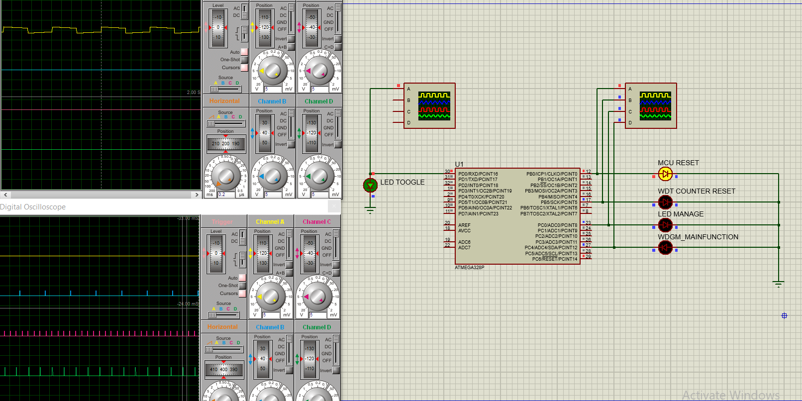
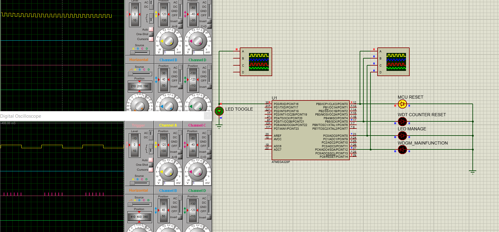
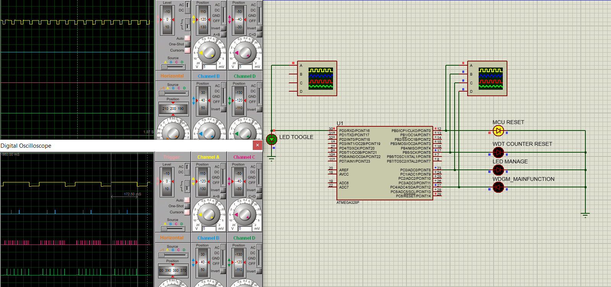
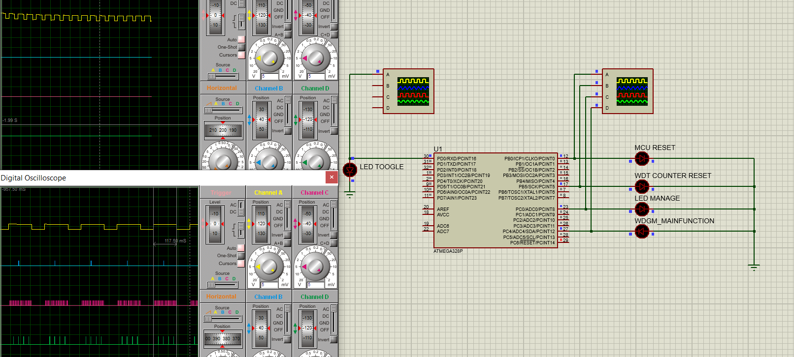

# LED Blinking Project with Watchdog Supervision

## Project Overview

This project implements an LED blinking system with watchdog supervision using the ATmega328p microcontroller. The primary objective is to ensure reliable operation of the LED blinking process, with a watchdog mechanism in place to reset the system in case of any malfunctions.

## Components

### LED Management
The LED blinking capability is handled through two software components:
- **LEDMgr**: Manages the LED blinking actions.
- **DIO (Digital Input/Output)**: Handles the initialization and control of the LED pin.

#### DIO Component
The DIO component provides the following functions:
- **DIO_Init**: Initializes the DIO configuration for the pin used to control the LED.
- **DIO_Write**: Writes a specific value (0 or 1) to the pin.

#### LEDMgr Component
The LEDMgr component provides the following functions:
- **LED_Init**: Initializes the LED component's internal variables.
- **LED_Manage**: Manages the LED blinking actions using the `DIO_Write` function.

The `LED_Manage` function should be called from a super loop every 10ms and should manage the LED blinking periodicity to be 500ms for each stage. The standard delay function can be used to manage the timing.

### Watchdog Management
The Watchdog management capability is handled through two different components:
- **WDGDrv**: Implements a complete driver for the window watchdog peripheral.
- **WDGM**: Manages the supervision of the LEDMgr component.

#### WDGDrv Component
The WDGDrv component provides the following functions:
- **WDGDrv_Init**: Configures the watchdog driver to support the following features:
  - Sets the maximum timeout value to 64ms.
  - Activates the watchdog.

A timer with ISR should be configured to be called every 50ms. In the timer ISR, the following conditions should be checked:
1. `WDGM_MainFunction` is not stuck.
2. The `WDGM` state set by `WDGM_MainFunction` is OK.

If both conditions are satisfied, the watchdog timer is refreshed; otherwise, it is left to reset.

#### WDGM Component
The WDGM component provides the following functions:
- **WDGM_Init**: Initializes the WDGM internal variables.
- **WDGM_MainFunction**: Checks the number of calls of the `LEDM_MainFunction` within a 100ms period. If the number of calls is between 8 and 12, the status is OK; otherwise, the status is not OK. This function should be called periodically every 20ms.
- **WDGM_ProvideSupervisionStatus**: Provides the status of the LEDMgr entity to the WDGDrv.
- **WDGM_AlivenessIndication**: Should be called from the `LED_Manage` function to detect its call at the correct timing.

## Requirements

1. Source code for the different components.
2. Simulation file for testing.
3. Screen recording of the simulation for the following scenarios:
   - **Positive scenario**: Checks the periodicity of the LED blinking, call of the `LED_Manage`, call of the `WDGM_MainFunction`, and refreshment of the WDGDrv. Timing evidence can be provided by using test pins toggle on the oscilloscope.
     
   - **Negative scenario 1**: Comments the call of the `WDGM_MainFunction` and checks that the watchdog reset occurs after 50ms.
     
   - **Negative scenario 2**: Comments the call of the `WDGM_AlivenessIndication` from the `LED_Manage` while the `WDGM_MainFunction` is executed periodically and checks that the watchdog reset occurs after 100ms.
     
   - **Negative scenario 3**: Changes the periodicity of the call of the `LED_Manage` to every 5ms and checks that the watchdog reset occurs after 100ms.
     

